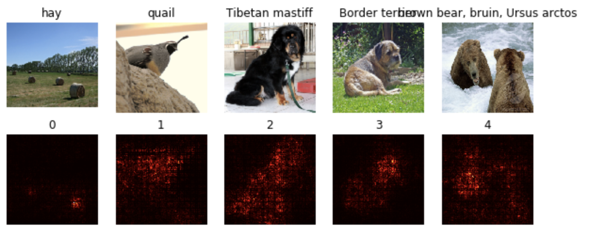
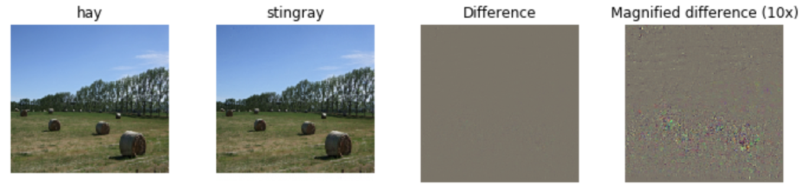
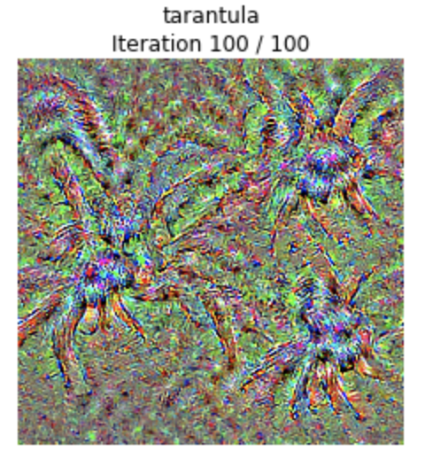
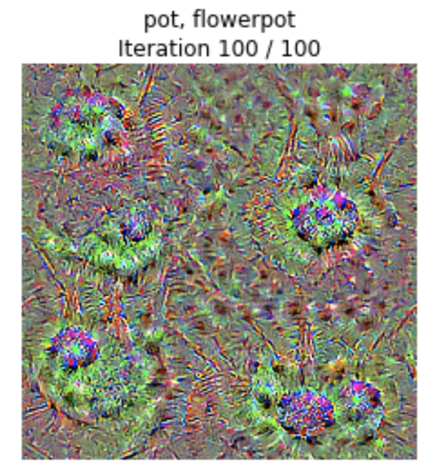
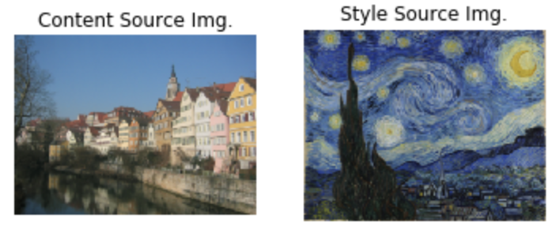
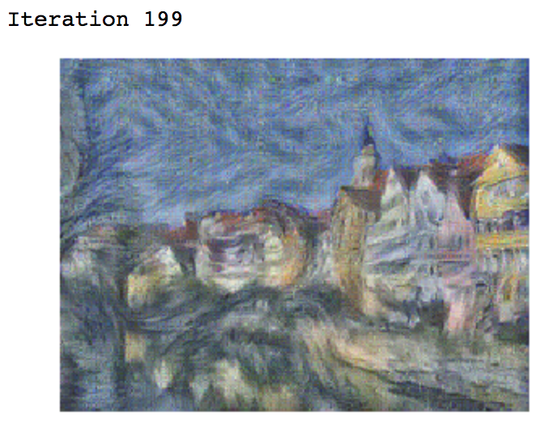
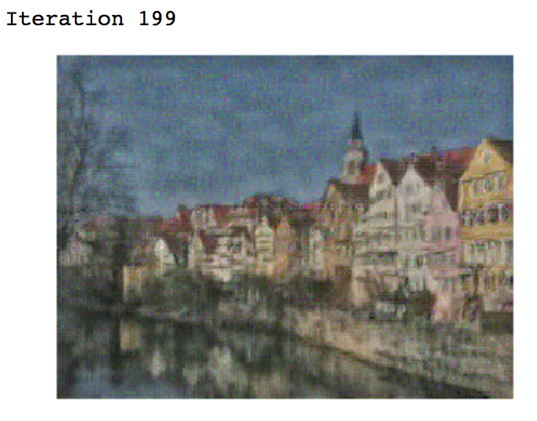

# image-captioning-style-transfer
Image captioning with vanilla RNNs and LSTMs on the [COCO dataset](http://cocodataset.org/#home). Network visualizations and style transfer on [SqueezeNet](https://github.com/DeepScale/SqueezeNet), which is a deep CNN pretrained to perform image classification on ImageNet.

* [Vanilla RNN Captioning](https://github.com/alexvlis/image-captioning-style-transfer/blob/master/RNN_Captioning.ipynb)
* [LSTM Captioning](https://github.com/alexvlis/image-captioning-style-transfer/blob/master/LSTM_Captioning.ipynb)
* [SqueezeNet Network Visualizations](https://github.com/alexvlis/image-captioning-style-transfer/blob/master/NetworkVisualization-TensorFlow.ipynb) 
  * **Saliency Maps:** <br />
   <br />
  * **Fooling Images:** <br />
   <br />
  * **Class Visualization:** <br />
   
* [Style Transfer:](https://github.com/alexvlis/image-captioning-style-transfer/blob/master/StyleTransfer-TensorFlow.ipynb)
  * **Style Transfer:** <br />
   
  * **Feature Inversion:**
  

## Installation ##
```
sudo pip install virtualenv
virtualenv -p python3 .env
source .env/bin/activate
pip install -r requirements.txt
pip install -r requirements_tf.txt
```

## Download Data ##
```
cd deeplearning/datasets/
./get_data.sh
```
